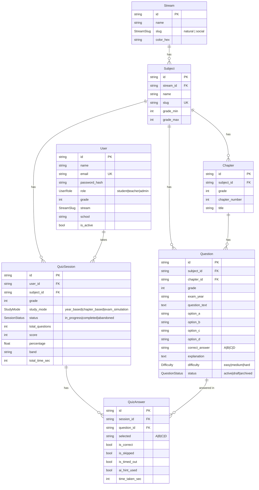

# 🇪🇹 Gaaffilee Qorumsa Barnootaa — Backend API

[](https://github.com/fahamijemal/gaaffilee-backend/actions/workflows/ci.yml)


**Ethiopian Grade 9–12 National Exam Practice Platform**

A production-grade NestJS REST API following hexagonal architecture principles. Deployed on AWS EC2 with Docker + GitHub Actions CI/CD.

**Live API:** `http://16.170.163.115:4000/v1`
**Swagger Docs:** `http://16.170.163.115:4000/docs`

---

## � Database Schema



---

## 🛠️ Tech Stack

| Layer | Technology |
|---|---|
| **Runtime** | Node.js 20 + TypeScript |
| **Framework** | NestJS 10 (Hexagonal Modular Monolith) |
| **Database** | PostgreSQL via Supabase (PgBouncer connection pooling) |
| **ORM** | Prisma 5 |
| **Cache / Queue** | Redis via Upstash (JWT denylist, nav cache, bulk jobs) |
| **AI** | Google Gemini via `AiProviderPort` (swappable adapter) |
| **Auth** | JWT HS256 + bcrypt (cost 12) + SHA-256 OTP |
| **Email** | Nodemailer + Gmail SMTP |
| **Container** | Docker (multi-stage Alpine) |
| **CI/CD** | GitHub Actions → SSH → EC2 |
| **Hosting** | AWS EC2 t3.micro (free tier) |

---

## 📁 Project Structure

```
src/
├── main.ts                         # Bootstrap + Swagger + CORS
├── app.module.ts                   # Root module
├── config/                         # Env validation (Joi) + constants
├── common/
│   ├── decorators/                 # @CurrentUser @Roles @Public
│   ├── guards/                     # JwtAuthGuard, RolesGuard
│   ├── filters/                    # HttpExceptionFilter (JSON errors)
│   ├── interceptors/               # TransformInterceptor, LoggingInterceptor
│   └── pipes/                      # ParseCuidPipe
├── prisma/                         # PrismaService (global module)
├── redis/                          # RedisService (global module)
└── modules/
    ├── auth/                       # JWT, OTP, bcrypt, account lock
    ├── navigation/                 # Streams/subjects/chapters (Redis cached)
    ├── questions/    [Hexagonal]   # Filter + Fisher-Yates shuffle
    ├── sessions/     [Hexagonal]   # State machine, timer, scoring
    ├── ai/           [Hexagonal]   # AiProviderPort → GeminiAdapter
    ├── dashboard/                  # Student analytics aggregation
    └── admin/                      # CRUD + CSV bulk import
```

---

## � Local Development

### Prerequisites
- Node.js 20+
- pnpm (`npm i -g pnpm`)
- Supabase project (or local PostgreSQL)
- Upstash Redis (or local Redis)

### Setup

```bash
# 1. Install dependencies
pnpm install

# 2. Configure environment
cp .env.example .env.local
# Fill in your Supabase, Upstash, Gemini, and SMTP values

# 3. Run migrations
pnpm prisma:migrate:dev

# 4. Generate Prisma client
pnpm prisma:generate

# 5. Seed (streams, subjects, admin user)
# First generate admin hash:
node -e "const b=require('bcrypt'); b.hash('Admin@1234',12).then(h=>console.log(h))"
# Add to .env: SEED_ADMIN_HASH=<hash>
pnpm prisma:seed

# 6. Start dev server
pnpm start:dev

# 7. Open Swagger
open http://localhost:4000/docs
```

---

## 🐳 Docker

```bash
# Build image
docker build -t gaaffilee-backend .

# Run with env file
docker run -d \
  --name gaaffilee-backend \
  --restart unless-stopped \
  --env-file .env \
  -p 4000:4000 \
  gaaffilee-backend

# View logs
docker logs gaaffilee-backend -f
```

---

## 🚢 Production Deployment (AWS EC2)

### CI/CD Pipeline
Every `git push main` automatically:
1. Runs lint + typecheck + tests
2. SSHes into EC2
3. Rebuilds Docker image
4. Restarts the container

### Required GitHub Secrets
| Secret | Value |
|---|---|
| `EC2_HOST` | EC2 public IP |
| `EC2_USER` | `ubuntu` |
| `EC2_SSH_KEY` | Contents of `.pem` key |

### Manual Deploy
```bash
ssh ubuntu@<ec2-ip>
cd ~/gaaffilee-backend
git pull origin main
docker stop gaaffilee-backend && docker rm gaaffilee-backend
docker build -t gaaffilee-backend .
docker run -d --name gaaffilee-backend --restart unless-stopped \
  --env-file .env -p 4000:4000 gaaffilee-backend
```

---

## 🌐 API Reference

| Module | Routes |
|---|---|
| **Auth** | `POST` /register /login /logout /refresh /forgot-password /verify-otp /reset-password · `GET PATCH` /me |
| **Navigation** | `GET` /streams /subjects /chapters /years /questions/count |
| **Questions** | `GET` /questions |
| **Sessions** | `POST` /sessions · `GET` /sessions /:id · `POST` /:id/answer /:id/skip · `PATCH` /:id/complete · `GET` /:id/review |
| **AI** | `POST` /ai/hint /ai/explain /ai/chat /ai/generate-questions /ai/weakness-report · `GET` /ai/weakness-report |
| **Dashboard** | `GET` /dashboard/me /me/weaknesses /me/trends /me/subjects /me/history |
| **Admin** | Full CRUD: /admin/questions /admin/chapters /admin/users /admin/analytics/* |

---

## 🔐 Security Model

| Concern | Implementation |
|---|---|
| **Authentication** | JWT HS256, 7-day expiry, `jti` on Redis denylist |
| **Password hashing** | bcrypt cost 12, 72-char max |
| **OTP** | SHA-256 hashed, 10-min TTL, 3-attempt limit |
| **Account lock** | 5 failed logins → 15-min Redis lock |
| **RBAC** | `student \| teacher \| admin` via `@Roles()` guard |
| **Input validation** | Global `ValidationPipe` (whitelist + forbidNonWhitelisted) |
| **Answer integrity** | `correct_answer` never included in `QuestionDeliveryDto` |
| **Timer enforcement** | Server-side validation for `exam_simulation` mode |
| **Idempotency** | `UNIQUE(session_id, question_id)` prevents duplicate answers |

---

## 🔑 Architecture Decisions

| Decision | Rationale |
|---|---|
| **Hexagonal on 3 modules** | sessions/ai/questions have domain logic worth isolating |
| **Redis fail-secure (JWT)** | Revoked tokens must never be accepted; 503 > bad auth |
| **Redis fail-open (cache)** | Navigation data isn't sensitive; DB fallback is safe |
| **PgBouncer pooling** | `DATABASE_URL` uses transaction pooler; `DIRECT_URL` for migrations only |
| **Fisher-Yates shuffle** | Unbiased question randomisation server-side |

---

## 🧪 Testing

```bash
pnpm test              # Unit tests
pnpm test:coverage     # Coverage report
pnpm typecheck         # TypeScript check
pnpm lint              # ESLint
```

---

## � Switching AI Provider

Implement `AiProviderPort` in a new adapter:

```typescript
// src/modules/ai/infrastructure/openai.adapter.ts
export class OpenAiAdapter extends AiProviderPort { ... }

// src/modules/ai/ai.module.ts — single line change:
{ provide: AiProviderPort, useClass: OpenAiAdapter }
```

---

## 📦 Bulk Question Import (CSV)

Use `POST /v1/admin/questions/bulk` with a CSV file:

```csv
subject,grade,chapter_number,chapter_title,exam_year,question_text,option_a,option_b,option_c,option_d,correct_answer,explanation,difficulty
Physics,11,3,Kinematics,2015,A car accelerates at 2 m/s². Velocity after 5s?,5 m/s,10 m/s,15 m/s,20 m/s,B,v=u+at=10m/s,easy
```

Poll job status with `GET /v1/admin/questions/bulk/{job_id}`.

---

## 📄 License

MIT © 2026 Gaaffilee
